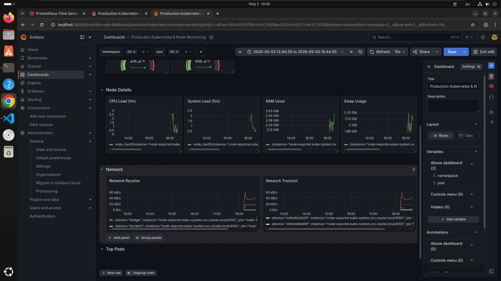
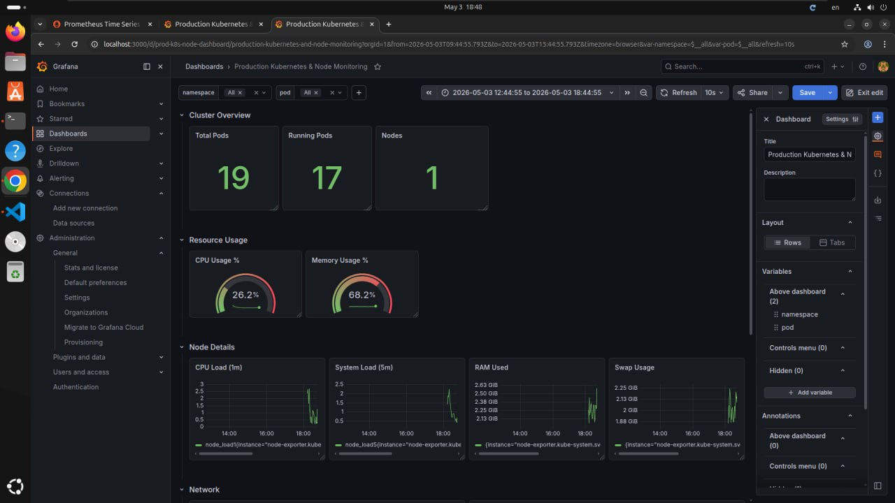

# 🚀 Kubernetes Monitoring Stack for Node.js API

## 📌 Project Overview

Production-like Kubernetes environment for deploying and monitoring a Node.js REST API with PostgreSQL, including full observability using Prometheus and Grafana.

This project simulates how real-world systems are deployed, monitored, and analyzed in modern DevOps workflows.

---

## 🏗️ Architecture

* Node.js API (Deployment)
* PostgreSQL (Persistent Volume)
* Kubernetes Resources:

  * Deployment
  * Service
  * Ingress
  * ConfigMap
  * Secret
* Monitoring Stack:

  * Prometheus
  * Grafana
  * node-exporter
  * kube-state-metrics

### 🔄 Request Flow

```
User → Ingress → Service → API → PostgreSQL
                         ↓
                   Prometheus → Grafana
```

---

## 🛠️ Tech Stack

* Node.js
* Docker
* Kubernetes (Minikube)
* PostgreSQL
* Prometheus
* Grafana

---

## ⚡ Features

* Containerized Node.js API
* Kubernetes-based deployment & networking
* Persistent storage using PV/PVC
* Secure configuration with ConfigMap & Secret
* Ingress-based routing
* Full monitoring and observability
* Custom Grafana dashboards

---

## 📊 Monitoring & Observability

The system provides real-time insights into:

* Pod status (Running / Pending / Failed)
* Node count
* CPU, Memory, Disk usage
* Network traffic
* Top pods by resource usage

---

## 📸 Screenshots

### 📊 Real-time Cluster Monitoring (CPU, Memory, Pods)



---

### 📈 Node-Level Metrics (CPU Load, RAM Usage)




---

## 🧠 Design Decisions

* **ConfigMap**: Used to externalize configuration instead of hardcoding values inside the container.
* **Secret**: Ensures sensitive data (e.g., database credentials) is not exposed in plain text.
* **Persistent Volume**: Guarantees PostgreSQL data persistence beyond pod lifecycle.
* **Prometheus + Grafana**: Industry-standard stack for metrics collection and visualization.
* **node-exporter & kube-state-metrics**: Provide deep visibility into node and Kubernetes object states.

---

## 📁 Project Structure

```
project-devops/
├── k8s/
├── monitoring/
├── assets/screenshots/
├── Dockerfile
└── README.md
```

---

## 🚀 How to Run

```bash
minikube start
minikube addons enable ingress
docker build -t project-api:latest .
kubectl apply -f k8s/
kubectl apply -f monitoring/
kubectl port-forward svc/grafana 3000:3000
```

---

## 🔮 Future Improvements

* Horizontal Pod Autoscaler (HPA)
* CI/CD Pipeline (GitHub Actions)
* Helm charts for easier deployment
* Centralized logging (Loki / ELK)
* Deployment on managed Kubernetes (EKS / GKE)

---

## 💡 Key Takeaways

* Built a production-like Kubernetes environment
* Implemented full observability stack
* Gained hands-on experience with real DevOps workflows


